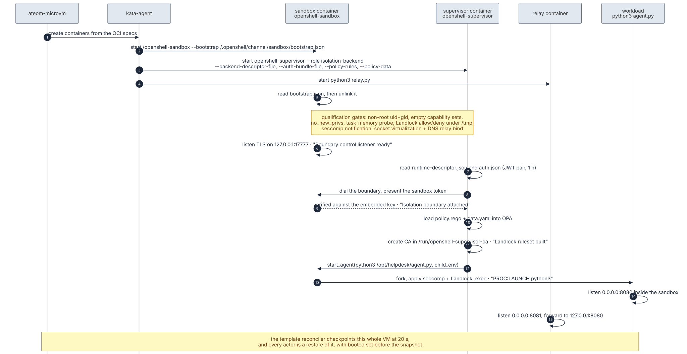
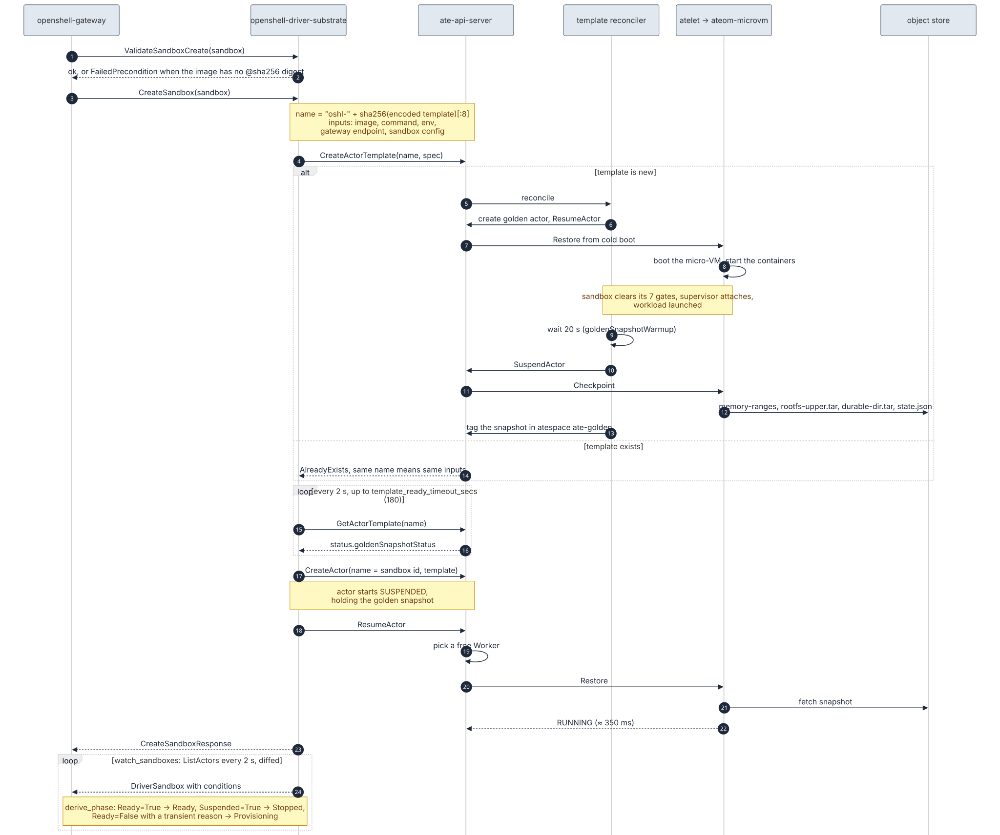
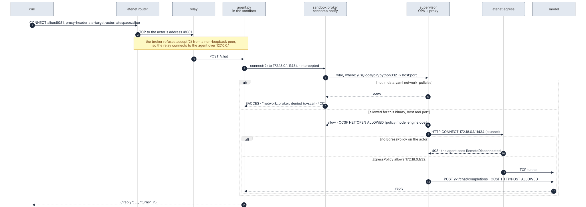
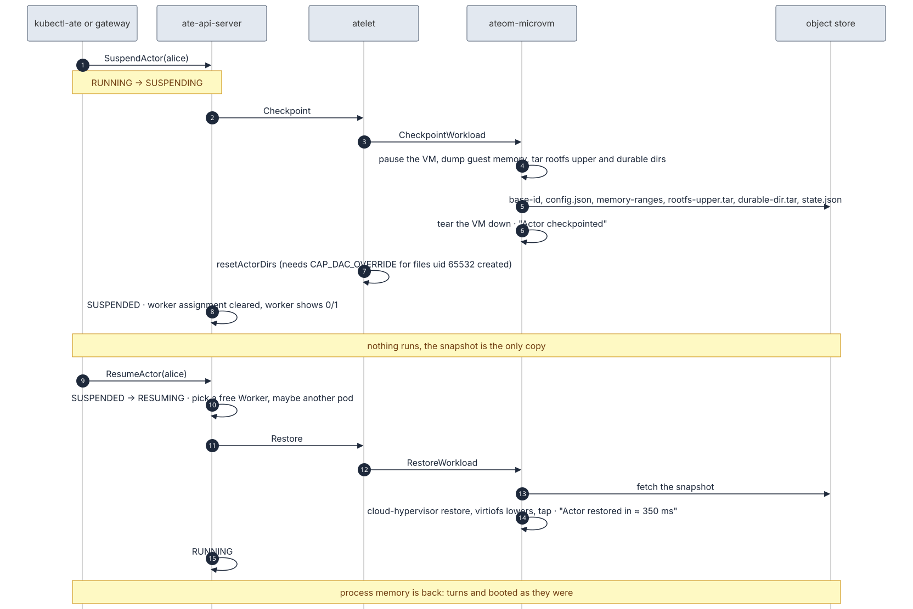
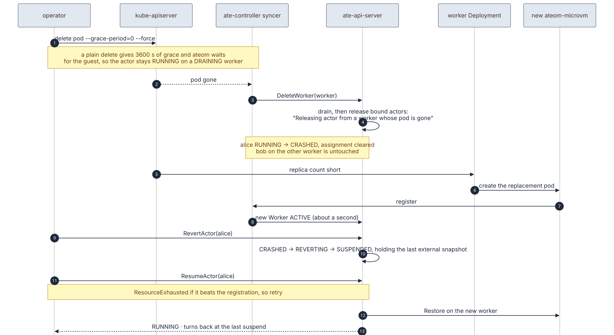

# Architecture

How an OpenShell sandbox becomes an Agent Substrate actor, what runs where,
and what each piece trusts. The diagrams are Mermaid sources in
[`diagrams/`](diagrams/), rendered to SVG by [`diagrams/render.sh`](diagrams/render.sh).

## In one paragraph

OpenShell's gateway creates and drives sandboxes through a `ComputeDriver`
gRPC contract. This repository is one such driver, running as its own process
on a Unix socket. It maps each gateway call onto Substrate's `ateapi.Control`
API: a sandbox is an `Actor`, a workload is one `ActorTemplate`, and starting a
sandbox is a restore of that template's golden snapshot into a micro-VM. Inside
the VM, stock OpenShell binaries run unmodified: `openshell-sandbox` holds the
workload, `openshell-supervisor` enforces policy and audits, and a small relay
container makes the workload reachable through Substrate's ingress. Nothing in
OpenShell, Substrate's guest kernel, or kata is forked; seven Substrate commits
are required and listed in [`upstream-branches.md`](upstream-branches.md).

## The big picture



Colors: green is stock OpenShell, blue is this repository, orange is
Substrate, purple is inside the guest, light green is Substrate's network edge.

Three trust domains meet here:

| Domain | Runs | Trusts |
|---|---|---|
| OpenShell gateway and this driver | outside the cluster, or as a pod | `ate-api-server` over TLS 1.3 with a bearer token whose audience is `api.ate-system.svc` |
| Substrate control plane and node agents | namespace `ate-system`, one atelet per node, one ateom per worker pod | Kubernetes RBAC, image digests, the object store |
| The guest | one micro-VM per actor | its own kernel and cloud-hypervisor; inside it, the sandbox trusts only the key embedded in its bootstrap |

## Components

### openshell-gateway, stock

Any `--compute-driver <name>` that is not one of the gateway's built-ins
resolves to an external driver at `--compute-driver-socket`. The gateway keeps
the sandbox catalog, mints the per-sandbox launch credentials, and derives a
sandbox's phase from the conditions the driver reports (`derive_phase`):
`Ready=True` is Ready, `Suspended=True` without `Ready=True` is Stopped, a
`Ready=False` with a reason on its transient allowlist is Provisioning, and
one with any other reason is a sticky Error. It also times out provisioning at
five minutes (`ProvisioningTimedOut`).

### openshell-driver-substrate, this repository

`src/main.rs` parses flags (or `SUBSTRATE_*` and `OPENSHELL_*` environment
variables), binds the socket, and serves `ComputeDriverServer`.

`src/lib.rs` implements the trait:

| ComputeDriver call | What the driver does |
|---|---|
| `get_capabilities` | Names itself `substrate`; `gateway_manages_lifecycle`, `supports_sandbox_authentication` and `driver_reports_runtime_readiness` are false. |
| `validate_sandbox_create` | Requires `spec.template.image` with an `@sha256:` digest. A bare tag fails atelet's pull cache later, so it is refused here. |
| `create_sandbox` | Names the template, `ensure_ready` (below), `CreateActor` (an `AlreadyExists` is a retried create and is fine), `ResumeActor`. |
| `start_sandbox` | `ResumeActor`. |
| `stop_sandbox` | `SuspendActor`: checkpoint, free the worker, keep the snapshot. |
| `delete_sandbox` | `DeleteActor` with `any_state: true`. The template stays; other actors may share it. |
| `get_sandbox`, `list_sandboxes` | `GetActor`, `ListActors` walked to the last page (1000 per page). |
| `watch_sandboxes` | Substrate has no watch RPC. The driver polls `ListActors` every 2 s, diffs against the last snapshot, and emits changed and deleted sandboxes. It stops when the gateway drops the stream. |
| `ensure_workspace` | `CreateAtespace` for the one configured atespace. The trait carries workspace identity only on create, so one atespace serves every workspace. |
| `delete_workspace` | No-op. |
| `authenticate_sandbox` | Unimplemented. |

One `ateapi.Control` channel is dialed lazily and reused. An interceptor adds
`Authorization: Bearer` from a token file read on every client build, so a
rotated projected token needs no restart. TLS is on when a CA bundle is
configured; a client certificate is optional and must come as a pair.

Conditions are the driver's only voice to the gateway, so `actor_state_conditions`
is written against the gateway's phase rules and pinned by a table test:

| Actor state | Conditions reported | Gateway phase |
|---|---|---|
| RUNNING | `Ready=True` (ContainerRunning) | Ready |
| RESUMING, REVERTING | `Bootstrapping=True`, `Ready=False` (ContainerStarting) | Provisioning; `Bootstrapping=True` is what lets a Stopped sandbox start |
| SUSPENDING, PAUSING | `Suspended=False` only | Provisioning |
| SUSPENDED, PAUSED | `Suspended=True`, `Ready=False` (ContainerStopped) | Stopped |
| CRASHED | `Ready=False` (ContainerExited) | Error, on purpose: it needs `RevertActor` |
| DELETING | `Ready=False` (ContainerStopped), `deleting` | Deleting |

### Template synthesis, `src/template.rs`

Everything the golden snapshot depends on goes into the template, and nothing
else: the image, the command, the environment (`spec.environment`, then
`spec.template.environment` over it, then `OPENSHELL_ENDPOINT` over both so a
caller cannot redirect the gateway address), the sandbox config name, and the
snapshot location. The template is encoded with prost, its metadata blanked,
and hashed; the name is `oshl-` plus the first eight bytes of the SHA-256. Two
sandboxes with the same inputs share one template and one golden snapshot.
Any change to what the template contains gets a new one.

Nothing per sandbox may be in a template. A snapshot freezes process memory,
so a per-sandbox value baked into it would come back identical in every actor
restored from it. The sandbox id and the gateway-minted token are left out for
that reason, and a test asserts it. That is also why the gateway path cannot
reach Ready today; see [Credentials](#credentials).

The synthesized shape is one container: capabilities dropped (`openshell-sandbox`
refuses to run with any capability in its bounding set), a durable-dir volume
at `/tmp` (its Landlock probe writes there and the stock image has no `/tmp`),
full snapshots on pause and commit, cold boot on first resume, sandbox class
micro-VM. The helpdesk example uses a hand-written three-container template
instead, because it needs a supervisor and a relay; the two shapes differ only
in what they contain, not in how Substrate treats them.

`ensure_ready` creates the template, tolerates `AlreadyExists`, then polls
`GetActorTemplate` every 2 s until `status.goldenSnapshotStatus.goldenTag` is
set, or `error_message` is set (FailedPrecondition), or 180 s pass
(DeadlineExceeded).

### Substrate control plane

- **ate-api-server** owns the resources (`Atespace`, `ActorTemplate`, `Actor`,
  `Worker`, `EgressPolicy`, `Tag`) in postgres and runs the workflows: resume
  picks a Worker and asks its node's atelet to restore; suspend asks for a
  checkpoint and clears the assignment; revert puts a crashed or running actor
  back at its last external snapshot; delete tears down from any state when
  asked. It speaks gRPC over TLS 1.3 with the `servicedns` trust bundle and a
  bearer token; it needs no client certificate.
- **template reconciler**, inside ate-api-server, gives a new template its
  golden snapshot: it creates one golden actor, resumes it from cold boot,
  waits a fixed 20 s (`goldenSnapshotWarmup`), suspends it, and tags the
  snapshot in atespace `ate-golden`. Whatever the VM looked like at 20 s is
  what every actor starts from.
- **ate-controller** turns a `WorkerPool` into a Deployment of worker pods and
  runs the syncer: a new pod registers as a Worker, a terminating pod marks
  its Worker `DRAINING`, a vanished pod deletes its Worker, which releases the
  actors bound to it into `CRASHED`.
- **atelet** is a DaemonSet, one per node and versioned per node. It pulls
  images by digest into a cache, builds the OCI specs (honoring the image's
  `USER`, dropping capabilities, setting `no_new_privileges` and the low-port
  sysctl for micro-VM), lays out durable dirs, and drives the node's ateoms
  through `AteomHerder`: Run, Checkpoint, Restore.
- **ateom-microvm** is the worker pod's process: it launches cloud-hypervisor,
  serves the rootfs layers over virtiofsd, talks to the kata-agent in the
  guest to start containers, and checkpoints or restores the whole VM. A
  worker hosts one actor at a time, so a pool of two gives two concurrent
  actors.
- **object store**: rustfs in kind, GCS on GKE. A snapshot is `base-id`,
  `config.json`, `memory-ranges`, `rootfs-upper.tar`, `durable-dir.tar`,
  `state.json`. A restore is about 350 ms.
- **atenet** is one binary in two roles. The router is ingress: an HTTP
  `CONNECT` on service port 8081 with an `ate-target-actor: atespace/name`
  header opens a TCP tunnel to any port on the actor. The egress terminates
  the actor's outbound `CONNECT`s and allows only what the actor's
  `EgressPolicy` names, 403 otherwise.

### Inside the micro-VM

One guest, one network namespace, three containers from the helpdesk template:

- **sandbox**: `openshell-sandbox` is PID 1 of the workload's container. It
  reads its bootstrap and unlinks it, refuses to run unless it is non-root,
  capability-free and `no_new_privs`, and probes the kernel for Landlock,
  seccomp user notification, socket virtualization and a DNS relay bind.
  Then it listens for its supervisor on `127.0.0.1:17777` over TLS. It forks
  the workload under seccomp and Landlock and brokers the workload's network
  calls.
- **supervisor**: `openshell-supervisor --role isolation-backend` finds the
  boundary through its runtime descriptor, authenticates with its token pair,
  loads the Rego policy and data into OPA, installs a TLS-interception CA the
  workload trusts, starts the workload through the sandbox, decides every
  connection, proxies the allowed ones, and writes OCSF audit lines.
- **relay**: plain `asyncio` in a plain container. The sandbox's broker refuses
  `accept(2)` from a non-loopback peer, so Substrate's router cannot reach the
  agent directly. The relay accepts on the actor's address and connects over
  loopback. It stands in for the gateway's loopback service endpoint.

The boundary channel is TCP on loopback, not a Unix socket: containers of one
actor share the guest network namespace, but a Unix socket on a shared
durable dir is not shared across them (`connect(2)` gives `ECONNREFUSED`).



## Lifecycle



An actor is born `SUSPENDED`, holding its template's golden snapshot. Resume
and suspend move it between `RUNNING` and `SUSPENDED` through a restore or a
checkpoint. If its worker pod disappears it is `CRASHED`; from there only
`RevertActor`, which puts it back at its last external snapshot, or delete are
allowed. The driver never issues a revert; the gateway sees `CRASHED` as Error
and an operator uses `kubectl-ate revert actor`.

## Sequences

### Creating a sandbox



The first `create_sandbox` for a workload pays for the golden snapshot: about
30 s in all, a few seconds of boot, the fixed 20 s warm-up, and the checkpoint. Every later one, and every later
actor of the same template, is a restore. The gateway's five-minute
provisioning ceiling is comfortably above this.

### Reaching the agent, and the two egress layers



Ingress is Substrate's router, the relay, then loopback into the sandbox.
Egress is decided twice, in order. First OpenShell: the sandbox intercepts
the workload's `connect(2)` with seccomp user notification and asks the
supervisor, whose shipped policy allows a connection only when `data.yaml`
names the destination host, port, and the binary making the call; a denied
call fails with `EACCES` inside the sandbox and the broker logs it. Then
Substrate: the supervisor's allowed connection leaves the actor as an HTTP
`CONNECT` to atenet egress, which allows only the CIDRs or hostnames in the
actor's `EgressPolicy` and answers 403 otherwise. Without both allowances
the model is unreachable, which is the point: neither the workload nor the
supervisor can widen its own reach.

### Suspend and resume



A checkpoint pauses the VM, writes guest memory plus the rootfs upper layer
and the durable dirs to the object store, and tears the VM down. The worker is
free at once. A resume picks any free worker, possibly on a different pod,
fetches the snapshot, and restores in about 350 ms. Process memory is exactly
as it was: the agent's chat history and its `booted` timestamp included.

### A host dies



A worker pod that vanishes takes its actor to `CRASHED`, and the Deployment
replaces the pod within seconds. A plain `kubectl delete pod` does not model
this: the pool's grace period is an hour and ateom waits for the guest
workloads, so the actor stays `RUNNING` on a `DRAINING` worker. Recovery is
revert then resume, and everything since the last suspend is lost. A gateway
that suspends idle sandboxes bounds that loss to the idle window.

## Credentials



OpenShell's sandbox and supervisor authenticate to each other with a pair of
Ed25519-signed JWTs and TLS material bound to one session id. In a normal
deployment the gateway mints them per sandbox and refreshes them. Here
`harness/bootstrap-gen` mints them with a local key, valid for one hour,
OpenShell's maximum, and the helpdesk images carry them: the sandbox's half
baked into the writable rootfs (it consumes its bootstrap), the supervisor's
half as a read-only image volume. `SandboxLaunchAuthentication` validates
against the key it embeds, so any key is an accepted trust anchor.

This is where the gateway path stops. The gateway's credentials are per
sandbox, a template is shared, and a snapshot freezes memory, so there is no
place in Substrate today to hand an actor a per-sandbox secret before its
first boot. The synthesized one-container template therefore has no supervisor,
no supervisor session forms, and the gateway holds the sandbox at Provisioning.
Two ways out, both outside this repository: a per-actor secret or file source
in Substrate, written before first boot and not into the golden snapshot; or
an OpenShell bootstrap that fetches its own per-sandbox credentials after
restore, so the snapshot holds nothing per sandbox.

## What a snapshot is, and what it is not

A snapshot is the whole VM: guest memory, the rootfs upper layer, the durable
dirs. It is not a health check. A container that died inside the VM before the
snapshot comes back dead in every restore, and Substrate reports the actor
`RUNNING` all the same. The golden snapshot is taken at a fixed 20 s, whether
or not the supervisor has attached by then. Read the worker pod's log:
`Boundary control listener ready`, `Isolation boundary attached` and
`PROC:LAUNCH` are the signs of a healthy golden actor.

Templates and their golden snapshots are never garbage-collected. The
driver's content-hash naming keeps their number equal to the number of
distinct workloads; the helpdesk's `build.sh` names its template from the
image digests for the same reason.

## Regenerating the diagrams

```sh
brew install mermaid-cli      # mmdc
docs/diagrams/render.sh
```

The SVGs use plain SVG text, not HTML labels, so they render in any viewer.
